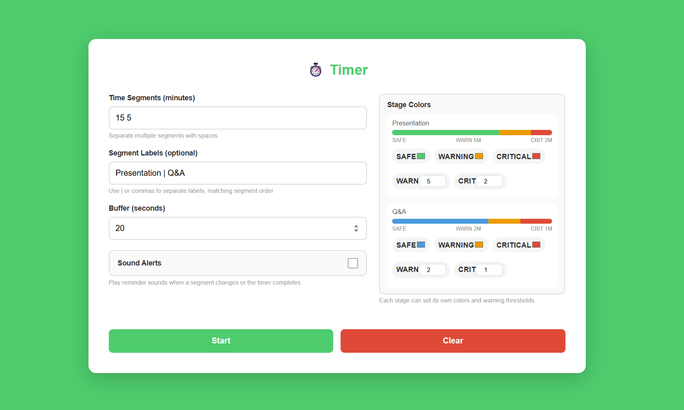
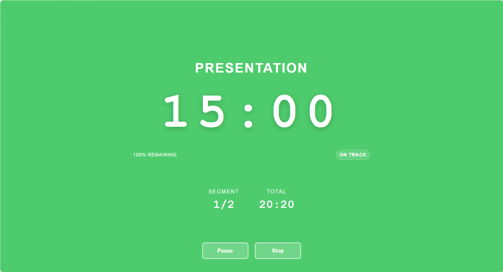

# Meeting Timer

### ⏱️ A focused timer for meetings, agenda control, and live note-taking

Built for structured sessions, cleaner pacing, and smoother facilitation.

  <strong>🌐 Entry URL</strong> 
  <a href="https://lijunrio.github.io/time-recored-app/">https://lijunrio.github.io/time-recored-app/</a>

  
  

## ✨ Product Overview

Meeting Timer is a lightweight web app designed for timed meetings and structured discussions. It helps moderators, presenters, and note-takers stay aligned with the agenda by running each segment in sequence with clear visual timing and transition buffers.

It works well for team meetings, presentations, review sessions, workshops, and any agenda that needs steady pacing. Each stage can be configured independently, which makes it practical for mixed meeting formats such as a longer presentation followed by a short Q&A.

## 🚀 Key Features

- Multi-segment countdown for agenda-based meetings
- Custom labels for each meeting stage
- Per-stage safe, warning, and critical color settings
- Per-stage warning and critical time thresholds
- Buffer time between segments
- Stage preview bars in the setup panel
- Full-screen timer view for live facilitation
- Pause, resume, and stop controls
- Audio alerts for transitions and completion

## 💼 Best Fit

- Team meetings
- Presentation timing
- Discussion rounds
- Workshop facilitation
- Real-time note-taking

## 🧭 How It Works

1. Enter segment durations in `Time Segments` using minutes separated by spaces.
2. Add matching labels in `Segment Labels`.
3. Configure each stage with its own colors and warning thresholds.
4. Set a buffer time in seconds.
5. Click `Start` to begin the meeting flow.
6. Use `Pause`, `Resume`, or `Stop` while running.

Example:

- Durations: `15 5 10`
- Labels: `Presentation | Q&A | Wrap-up`
- Stage setup: each stage can define its own `Warn` and `Crit` minutes
- Buffer: `20`

---

🚀 Release 1.1 • 📅 April 10, 2026

